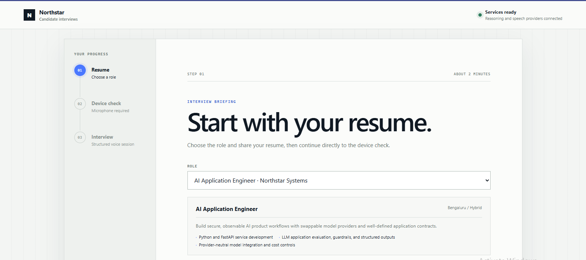
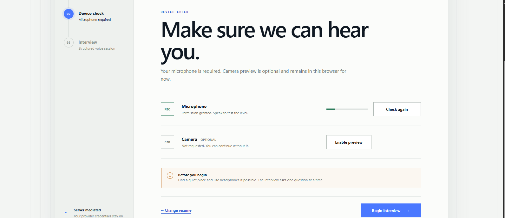
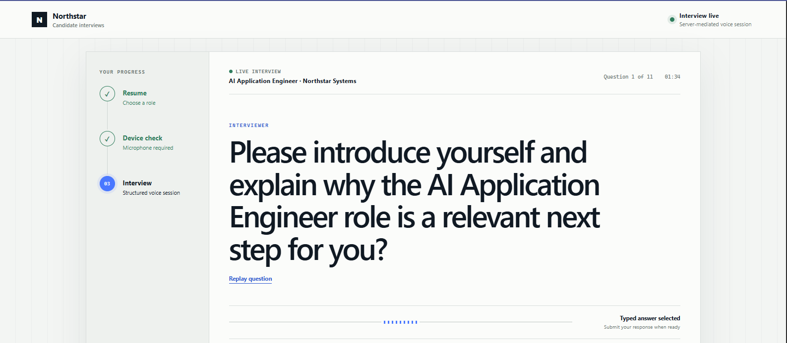

# Agentic Interviewer

An interview assistant that conducts structured, conversational interviews using a job description and the candidate's resume. It adapts follow-up questions to answers and prepares an evidence-backed assessment for human review.

Built with Python, FastAPI, LangGraph, and Pydantic, the project provides a browser-based interview experience with reasoning, speech recognition, and text-to-speech behind provider-neutral interfaces. The supplied configuration uses vLLM for reasoning and Speaches for speech.

## What it offers

- **Resume- and job-grounded questions:** prepares questions from source-backed claims, with configurable focus and company questions.
- **Adaptive conversation:** asks bounded follow-ups, handles clarification and repeat requests, and supports skipping questions.
- **Voice-enabled interviews:** includes microphone checks, automatic answer capture, spoken questions, and typed-answer fallback.
- **Evidence-backed review:** links assessments to transcripts and supports corrections, reviewer overrides, approvals, appeals, and exports.
- **Session persistence and controls:** includes durable session storage, tenant-aware APIs, audit records, and configurable usage budgets.
- **Provider flexibility:** separates reasoning, transcription, and synthesis through typed contracts and dedicated adapters.

The project is currently intended for synthetic-data development and evaluation. Production release gates are tracked in the documentation. It assists human reviewers and does not make final hiring decisions.

## Setup and run

### Requirements

- Python 3.12 and [uv](https://docs.astral.sh/uv/).
- PostgreSQL; Docker Compose can run the supplied database service.
- For self-hosted inference: Docker Compose with NVIDIA GPU support and sufficient GPU memory for the selected models.
- For hosted inference: compatible provider endpoints and credentials. A GPU is needed only for models you host yourself.

Run the following PowerShell commands from the project root.

### 1. Configure the project

```powershell
if (-not (Test-Path .env)) { Copy-Item .env.example .env }
uv sync --all-groups
```

Review `.env` for provider endpoints, model names, database settings, and application controls.

### 2. Choose your inference setup

Reasoning, transcription, and synthesis use separate adapters, so you can choose how each capability is served:

- **Use the supplied Docker stack:** run the configured vLLM reasoning model and Speaches speech models using the commands below.
- **Self-host other models:** configure a compatible model server, choose its model and GPU allocation, and update the matching endpoint/model settings in `.env`. Size GPU memory for model weights, context, concurrency, and any speech models sharing the device. If changing the supplied vLLM service, update its model arguments and GPU configuration in `compose.vllm.yaml` as well.
- **Use an inference provider:** configure `REASONING_BASE_URL`, `REASONING_API_KEY`, and `REASONING_MODEL` for an OpenAI-compatible reasoning endpoint. Keep `PROVIDER_PROFILE=local-specialized` to retain Speaches speech, or select `openai-compatible` and configure the `AUDIO_*` endpoint, credentials, models, and voice for compatible speech APIs. Set region, external-processing, retention, and health-check settings to match the provider; explicitly allow external processing where required.

Providers with different protocols need an adapter implementing the relevant domain contract. The generic audio adapters support buffered speech; the bundled browser's realtime transcription currently uses the Speaches adapter. See the [provider configuration guide](docs/PROJECT_GUIDE.md#5-configuration) for details.

**Supplied Docker stack**

```powershell
docker compose up -d postgres speaches
docker compose -f compose.vllm.yaml --profile q4 up -d vllm-q4
```

Wait for the services to become healthy, then download the configured speech models:

```powershell
Invoke-RestMethod -Method Post http://127.0.0.1:8001/v1/models/Systran/faster-distil-whisper-small.en
Invoke-RestMethod -Method Post http://127.0.0.1:8001/v1/models/speaches-ai/Kokoro-82M-v1.0-ONNX
```

### 3. Start the application

For the supplied Docker stack:

```powershell
docker compose up -d --build app
```

For a custom self-hosted or inference-provider configuration, start PostgreSQL and run the application using your `.env` settings:

```powershell
docker compose up -d postgres
uv run uvicorn agentic_interviewer.api.app:app --host 127.0.0.1 --port 8000
```

Choose one application launch method. To containerize a custom configuration, also update the application environment and service dependencies in `compose.yaml`, which otherwise select the supplied inference stack.

Open the [interview application](http://127.0.0.1:8000/) or the [API documentation](http://127.0.0.1:8000/docs). Select a job, upload a synthetic resume, complete the microphone check, and begin the interview.

## UI
A simple UI has been setup to test the interview process, please see examples below. 

#### Example: Uploading resume

Upload your resume for a job to start.



#### Example: Check for mic and camera

After uploading resume, test for mic and camera and permissions.



#### Example: Interview Starts

Once device is confirmed working, begin voiced interview.



## Documentation

See the [Project Guide](docs/PROJECT_GUIDE.md) for architecture, configuration, provider integration, and operating details. The [docs folder](docs/) contains the release checklist, security guidance, runbooks, design decisions, and evaluation reports.
