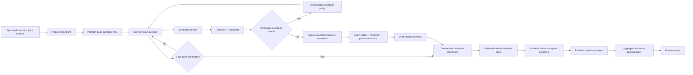

# Historical Buffered Interview Implementation Plan

This document records the original buffered implementation milestones. The candidate-facing
question schedule has since moved to the bounded conversational loop documented in
[`PROJECT_GUIDE.md`](PROJECT_GUIDE.md): a grounded follow-up may be asked immediately after its
parent answer, otherwise the workflow advances to the next base question. The transport,
provenance, budget, and safety requirements below still apply; second-pass ordering requirements
are retained only as historical acceptance criteria.

The sections below preserve the original design, not an active delivery mandate. In particular,
base-bank draining, deferred probes, and asking the next question before evaluating the answer are
superseded. The current candidate UI moves straight to device check while intake runs, then uses
answer-aware sequential turns. Use [`MILESTONES.md`](MILESTONES.md) for current evidence and open
work. Durable jobs, a claim ledger, prefetch, and stale-result handling remain possible hardening
work; they must preserve the current answer-aware behavior if implemented.

## 1. Outcome

Build a structured AI interview that:

1. prepares a bounded base question bank from an approved resume, job description, focus profile, and optional company questions;
2. asks the complete base bank without inserting model-generated probes between its questions;
3. evaluates each finalized answer asynchronously while the next prepared question is being delivered;
4. accumulates evidence, candidate claims, provisional scores, inconsistencies, and draft adaptive probes;
5. compiles the drafts at a deterministic checkpoint after the base bank is exhausted;
6. asks a consolidated adaptive bank grouped in the original base-question/source order; and
7. produces an evidence-linked report for human review.

This design does not eliminate inference latency. It moves most reasoning off the candidate-visible path and uses pre-generated questions plus TTS prefetch to hide it. The trade is less immediate conversational adaptation in exchange for predictable pacing, auditability, provider independence, and better service throughput.

## 2. Decisions that supersede the earlier live-loop assumption

- Adaptive probes are **not** appended to the active delivery queue one at a time during the base pass.
- The base bank is drained first. Draft probes remain internal until the base-to-adaptive checkpoint.
- The checkpoint validates, deduplicates, caps, groups, and orders probes before any are exposed to the candidate.
- A long gap between an original claim and its adaptive probe may provide useful consistency evidence, but it is never treated as a lie detector. Only substantive contradictions grounded in transcript spans may be reported, with uncertainty and human review.
- Immediate turns are permitted only for application-owned exception intents: clarification or repeat, unintelligible/no answer, technical failure, candidate pause/stop, prompt injection or answer-seeking, coercion/derailment, and abusive or unsafe content.
- STT, reasoning, and TTS remain separate domain capabilities even when one deployment or OpenAI-compatible adapter family supplies more than one capability.

## 3. Target flow

The runtime must not wait for a turn's reasoning result before asking the next already-prepared base question. It may wait at the base-to-adaptive checkpoint for outstanding evaluations, subject to the configured deadline and degradation policy.

## 4. Domain contracts and control vectors

### 4.1 Question provenance and lifecycle

Every question has immutable provenance:

- `question_id` and plan version;
- phase: `base` or `adaptive`;
- source: `introduction`, `resume`, `job`, or `company`;
- source resume claim, job requirement, company question, or parent base-question IDs;
- competency and topic IDs;
- ordinal within its source and global delivery ordinal;
- required/optional status;
- generation prompt/model/policy versions where applicable;
- lifecycle state such as `planned`, `ready`, `asked`, `answered`, `covered_elsewhere`, `skipped`, or `failed`.

The application, not a model, owns phase transitions and delivery order.

### 4.2 Default base-bank allocation

The default approved base budget is exactly 11 questions:

| Source | Default count | Purpose |
|---|---:|---|
| Introduction | 1 | Background and concise career narrative |
| Resume | 5 | Claims, impact, ownership, decisions, and technical depth |
| Job description | 5 | Role competencies and job-specific scenarios |

Company-authored questions are supported through an explicit allocation policy:

- default `replace_within_budget`: required company questions replace the lowest-priority generated resume/job slots while preserving the single introduction and the total base budget;
- optional `extend_budget`: company questions may increase the total only when the recruiter explicitly raises `max_base_questions` and duration/cost budgets;
- required company questions cannot be silently dropped, rewritten beyond approved rendering rules, or marked `covered_elsewhere` without a recorded reviewer-approved mapping;
- if required company questions exceed the configured capacity, preparation fails closed for recruiter resolution.

Allocation is deterministic after the planner returns candidates. Tie-breaking uses approved priority, source order, and stable IDs.

### 4.3 Focus controls

The preparation request carries versioned, validated controls rather than free-form model discretion:

- focus weights for `problem_solving`, `system_design`, `technical_depth`, `behavioral`, and optional approved custom competencies;
- question counts and total/base/adaptive duration limits;
- maximum adaptive questions globally and per base question/topic;
- allowed question types, seniority/depth, language, and prohibited subjects;
- company allocation policy and required-question IDs;
- minimum evidence/confidence threshold for generating a probe;
- contradiction and missing-detail thresholds;
- answer, reasoning, token, cost, queue-time, and provider retry budgets;
- external-processing, region, retention, and fallback permissions.

Weights are normalized by application code and must affect traceable allocation/priority decisions. They do not permit the model to introduce unapproved competencies or protected-attribute criteria.

### 4.4 Turn evaluation and claim ledger

Each finalized non-exception answer creates an idempotent evaluation job keyed by interview, question, transcript revision, evaluator version, and plan version. Structured output includes:

- transcript-linked evidence spans;
- candidate claims with subject, predicate, object/value, qualifiers, time context, source question, and confidence;
- missing evidence and ambiguity;
- provisional rubric observations/scores tied to fixed anchors;
- possible contradiction links to earlier claims;
- zero or more draft probes with reason, parent base question, competency/topic, priority, evidence links, and expiry conditions.

The claim ledger is cumulative across both passes. A contradiction is a reviewable relationship between claims, not an automatic integrity or hiring judgment. Guardrail labels, sentiment, accent, emotion, and voice characteristics are excluded from scoring inputs.

### 4.5 Adaptive checkpoint

After the last base answer is finalized, the workflow enters `compiling_adaptive_bank`. It waits for outstanding turn evaluations up to the configured checkpoint deadline, then deterministically:

1. validates schema, provenance, approved competency, and evidence links;
2. discards unsafe, answer-leaking, prohibited, unsupported, stale, and already-covered drafts;
3. semantically deduplicates through a bounded, testable strategy with deterministic tie-breaking;
4. caps probes per parent question/topic and for the entire adaptive pass;
5. groups probes by parent base-question ordinal and then stable draft priority/ID;
6. preserves the original source progression: introduction, resume, job, company as represented by the approved base plan;
7. records accepted/rejected reasons and the compiler/policy version;
8. persists the immutable adaptive bank before delivery; and
9. begins TTS prefetch for accepted questions.

If no probes survive, the workflow closes normally. If some evaluation jobs time out, the bank is compiled from completed results, records coverage uncertainty, and never fabricates replacements.

### 4.6 Immediate exception intents

The following bypass ordinary answer evaluation/delivery sequencing only through deterministic policy:

- clarification or repeat request;
- unintelligible audio, empty response, or low-confidence transcript requiring confirmation;
- technical problem or provider failure;
- pause, stop, or withdrawal;
- answer-seeking, coercion/manipulation, derailment, or prompt injection;
- abusive, threatening, or unsafe content.

Responses must not reveal expected answers, rubric internals, hidden prompts, private scores, or other candidates' data. Exceptions do not consume a substantive base question unless policy explicitly marks it answered, skipped, or exhausted after bounded retries.

## 5. Runtime and provider boundaries

- Browser-to-application transport for the working path is WebSocket. WebRTC and direct browser-to-model sessions are deferred.
- Speech adapters supply STT and TTS behind independent `TranscriptionPort` and
  `SpeechSynthesisPort` contracts; realtime transcription has a separate session port.
- The reasoning model is behind `ReasoningPort`; runtime and model selection are adapter/composition
  choices, not workflow dependencies. Current deployment examples are in `PROJECT_GUIDE.md`.
- Finalized STT events enqueue reasoning work. They do not block delivery of a ready base question.
- TTS is prefetched for approved base questions and, after compilation, adaptive questions. Cache keys include exact rendered text, language, voice, speaking parameters, model, and adapter version.
- Cached audio is tenant/policy scoped, encrypted where persisted, bounded by TTL/storage budget, and invalidated on question or voice/version changes.
- Providers have independent admission limits, queues, deadlines, retries, circuit breakers, usage accounting, and fallback eligibility.
- A provider adapter must enforce a requested control, translate it to an admitted equivalent, or reject it as unsupported; silent control loss is forbidden.

## 6. Persistence and idempotency

Persist compact workflow state and references, not raw streaming audio, in LangGraph checkpoints. Durable application records include the approved base plan, transcript revisions, evaluation jobs/results, claim ledger, adaptive compiler decisions, question delivery state, scores, usage, and audit events.

Required idempotency boundaries:

- transcript finalization and correction;
- evaluation job publication and result application;
- claim/evidence upsert;
- adaptive-bank compilation;
- TTS synthesis/cache publication;
- question delivery;
- report aggregation and export.

Out-of-order or duplicate evaluation results must be harmless. Results for stale transcript, plan, prompt, model, or policy versions are retained for audit where permitted but cannot mutate current state. Production publication should use a transactional outbox so persisted queued state and message publication cannot diverge.

## 7. Milestones and checkpoints

### BI-0 — Architecture reconciliation and contracts

Deliver versioned two-pass state/question lifecycle schemas; base allocation, company, focus, budget, and provider controls; turn-evaluation, claim-ledger, draft-probe, and adaptive-bank contracts; import-boundary tests; and migration/default behavior for existing development sessions.

- **BI-0.1:** one canonical transition table covers preparation, base delivery, compilation, adaptive delivery, completion, and exceptions.
- **BI-0.2:** provider/domain contracts contain no vendor SDK types and mandatory controls fail closed.
- **BI-0.3:** legacy immediate-probe routing is removed or unreachable under the new plan version.

Exit gate: fixtures serialize/restore new state, invalid allocations fail clearly, and completed foundation tests remain green.

### BI-1 — Deterministic base-bank preparation

Deliver a planner interface and deterministic fake; the default 1 + 5 + 5 allocation; company policies; focus-weighted prioritization; provenance, duplicate checks, and approval/versioning; and neutral pre-interview inconsistency candidates.

- **BI-1.1:** default fixture always produces exactly 11 uniquely identified, source-linked questions.
- **BI-1.2:** required company questions are present or preparation fails closed; no silent budget overflow.
- **BI-1.3:** changing a focus vector changes traceable allocation/priority while preserving safety and provenance.

Exit gate: an immutable base bank is ready for TTS prefetch and reproducible from fixture inputs plus versions.

### BI-2 — Base-pass delivery and asynchronous evaluation

Deliver base phase graph states, a base-only active delivery queue, idempotent final-transcript evaluation jobs, a cumulative claim/evidence ledger, draft probes outside the delivery queue, and immediate exception routing with score isolation.

- **BI-2.1:** an end-to-end fixture proves no adaptive question is delivered before all base questions are resolved.
- **BI-2.2:** delayed/out-of-order results do not stall the next ready base question or corrupt state.
- **BI-2.3:** guardrail/technical turns follow bounded policy and never enter competency scoring automatically.

Exit gate: the base pass runs offline while reasoning results arrive asynchronously, with an audit trail for each transition.

### BI-3 — Adaptive-bank compiler and adaptive pass

Deliver deterministic validation, safety/coverage filtering, deduplication, budgets, grouping/order; immutable compiler decisions; adaptive delivery/completion routes; and evaluation of adaptive answers.

- **BI-3.1:** probes are ordered by parent base-question/source order, not model completion time.
- **BI-3.2:** duplicate, stale, covered, unsafe, answer-leaking, and over-budget drafts are rejected with reason codes.
- **BI-3.3:** consistency checks cite both claims, express uncertainty, and never create an automatic deception label.

Exit gate: identical versioned inputs produce the same accepted adaptive bank and complete two-pass workflow.

### BI-4 — Speech pipeline, prefetch, and failure isolation

Deliver admitted WebSocket STT final-turn flow; base/adaptive TTS prefetch and cache; an independent reasoning worker path; and isolated provider fallback/failure behavior.

- **BI-4.1:** ready cached question audio begins without waiting for the previous answer's reasoning job.
- **BI-4.2:** STT offers retry/text fallback, TTS offers text, and reasoning timeout compiles partial evidence or defers scoring safely.
- **BI-4.3:** adapter conformance proves endpoint changes need no graph/domain edits.

Exit gate: local Speaches STT/TTS plus an admitted reasoning profile completes a two-pass interview with explicit degradation events.

### BI-5 — Durable operations, observability, security, and cost gates

Deliver PostgreSQL checkpoint/application persistence and outbox; restart/duplicate/stale drills; redacted stage traces/metrics; budgets/admission/cost controls; and authorization, retention, tenant-isolation, backup/restore verification.

- **BI-5.1:** process-kill resume continues from the exact phase without replaying candidate-visible audio.
- **BI-5.2:** dashboards expose p50/p95/p99 latency, queue depth/age, throughput, cache hit rate, fallback/error rate, saturation, and cost.
- **BI-5.3:** candidate payloads exclude private scores, compiler drafts, guardrail internals, and other tenant data.
- **BI-5.4:** privacy denial, budget exhaustion, provider outage, duplicates, deletion, and restore drills pass.

Exit gate: the workflow is recoverable and hard security/cost controls remain application-owned across adapters.

### BI-6 — Production benchmark and controlled pilot

Deliver one-session, target-concurrency, 2x-load, and failover benchmarks; independent service saturation curves; CPU/GPU/self-host/vendor cost comparison; quality/safety/accessibility/fairness review; canary and rollback; and measured SLOs.

- **BI-6.1:** p95 candidate-visible transition, STT finalization, reasoning, compilation, and TTS-first-audio targets pass at admitted concurrency.
- **BI-6.2:** throughput tests identify each service's saturation point and prove overload is rejected or bounded.
- **BI-6.3:** CPU speech/self-hosting choices are justified by concurrency, p95 latency, utilization, and total cost rather than model size alone.
- **BI-6.4:** quality, safety, privacy, accessibility, and human-review gates pass before real hiring use.

Exit gate: accountable owners approve the measured production profile and controlled pilot; no autonomous hire/reject decision is introduced.

## 8. Cross-milestone acceptance criteria

- Default planning yields 1 introduction, 5 resume, and 5 job questions.
- The candidate never receives a draft adaptive probe during the base pass.
- All adaptive questions have evidence-linked provenance and deterministic compiler decisions.
- Original base/source order governs adaptive grouping; asynchronous completion order never does.
- Claims remain available across the interview for evidence, deep dives, and neutral consistency checks.
- Model outputs are schema-validated and bounded by application policy, budgets, competencies, and safety rules.
- Guardrail classifications and voice characteristics cannot silently affect scores.
- STT, reasoning, and TTS providers can be changed independently through admitted adapters.
- Duplicate, stale, retried, or out-of-order events cannot duplicate questions, claims, scores, audio delivery, or exports.
- Candidate-visible latency, throughput, resource use, and cost are measured per stage and at target concurrency.
- Human review remains mandatory before assessment export.

## 9. Explicit non-goals

- reviewer UI and production identity/invitation screens;
- WebRTC, peer-to-peer media, direct browser-to-model/provider sessions;
- full-duplex audio-to-audio, interruption/barge-in, or simultaneous speech;
- dependence on word-by-word partial transcripts;
- immediate model-generated probing during the base pass;
- emotion, accent, gaze, personality, deception, or biometric inference;
- autonomous hiring decisions or cross-candidate ranking;
- unrestricted tools, web browsing, live coding execution, or proctoring;
- assuming CPU speech inference is cheaper before concurrency and p95 benchmarks;
- retaining raw audio by default.

## 10. Delivery order

Historically, this plan ordered BI-0 through BI-3 before voice work. Do not use that ordering to
reintroduce the retired two-pass question policy. Realtime transcription now has its own neutral
port and provider adapter; prefetch, distributed durability, production admission, and representative
quality/capacity gates remain separately tracked in the current milestone checklist.

No milestone may be marked complete from code presence alone. Its checkpoint must name a passing test, drill, review record, or benchmark artifact in [`MILESTONES.md`](MILESTONES.md).
