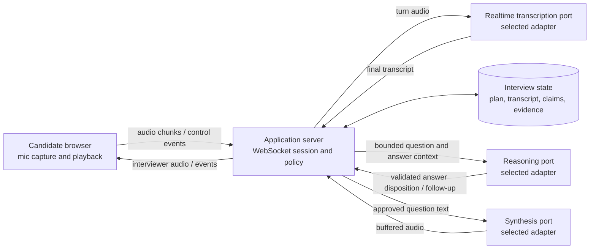
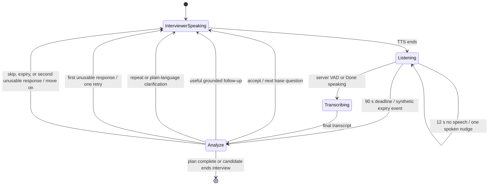

# Voice Architecture Decisions

## Status and scope

This document records the current voice-transport and interview-orchestration decisions for the
Agentic Interviewer. It describes the backend and provider flow after a candidate joins a voice
interview. The initial resume/device/sequential-interview browser slice now implements this mediated
shape; reviewer UI and full-duplex media remain deferred.

The selected MVP is a turn-based conversational system over a browser-to-application WebSocket. It uses separate speech-to-text (STT), text reasoning, and text-to-speech (TTS) capabilities behind application-owned contracts. This is a deliberate foundation for proving the interview process, guardrails, evidence model, and operating controls before attempting full-duplex, direct audio-to-audio interaction.

## The actual topology

There are three logical actors—the candidate, the application, and the AI interviewer—but they are not three network peers. The interviewer is application behavior implemented by models and workflow state, not another browser participating in a peer-to-peer call.

The browser therefore connects to the application, not directly to providers. The application owns
interview state and calls downstream services through selected adapters. Authenticated production
browser/socket integration remains a release gate, as detailed below.

WebRTC is not required merely because the experience contains live audio. It becomes valuable when the product needs browser-grade real-time media transport features such as jitter buffering, congestion control, packet-loss recovery, echo-processing integration, or full-duplex interruption. A WebSocket is sufficient for the current sequential, committed-turn flow, provided the browser captures audio in an admitted format and the application implements framing, backpressure, turn boundaries, reconnect behavior, and bounded buffering.

## Why WebRTC and a direct realtime-model connection are deferred

A browser can establish WebRTC directly with a realtime audio model by using a short-lived credential minted by the application. That design does not inherently remove all server control: the server can prepare session instructions, retain a control channel, receive events, and terminate or update a session. It does, however, move the media plane and part of the live conversational state outside the application's synchronous path.

That creates additional work before it is suitable for this interview use case:

- Resume facts, job requirements, rubric versions, company questions, and interview limits must be prepared and bound to the live session without exposing privileged source material unnecessarily.
- The application must observe enough canonical conversation state to detect derailment, answer-seeking, coercion, prompt injection, and policy violations, then intervene reliably despite network delay or missing events.
- Candidate claims must be correlated with the exact question, transcript version, evidence, and scoring anchor. A model's transient conversational memory is not an auditable system of record.
- Provider-issued ephemeral credentials, session ownership, reconnects, revocation, recording consent, retention, and regional-processing policy need explicit designs.
- A direct audio-to-audio model may blend transcription, reasoning, and speech generation in ways that are harder to validate, route independently, replay deterministically, or degrade safely.

These are solvable problems, not arguments that WebRTC or direct realtime models are insecure by definition. They are deferred because the MVP first needs an observable and testable interview workflow. A WebRTC media path can be introduced later without changing the domain contracts or authoritative interview state.

## Selected MVP: mediated, three-capability pipeline

The MVP uses this sequence for each candidate turn:

1. The browser streams framed audio chunks and turn-control events to the application WebSocket.
2. The application validates origin, query and message bounds and delegates to the composed
   realtime transcription port. Production authenticated admission and per-interview socket
   lifecycle require the remaining integration work described below.
3. The selected realtime STT adapter sends admitted audio to its upstream and returns normalized
   final-turn events. Partial text is optional and must not be treated as authoritative evidence.
4. The application attaches that transcript to the delivered question and stores provenance. Candidate corrections preserve the original and corrected text.
5. Reasoning analyzes the current question and finalized answer with bounded context. A durable
   cross-turn claim ledger and asynchronous analysis jobs are not implemented.
6. Structured dispositions are validated before the workflow admits evidence or a grounded follow-up.
7. Only application-approved interviewer text is sent to the TTS port. The buffered adapter returns
   complete audio for browser playback; text remains the fallback if synthesis is unavailable.

Mediating finalized turns through the application keeps the application—not any provider—as the authority for question ordering, guardrails, evidence, budgets, retries, and termination. Raw candidate audio should not be sent to the reasoning model. Raw audio retention should default to disabled after the admitted transcription/correction lifecycle unless an explicit consent and retention policy says otherwise.

### Direct audio-to-audio versus STT to reasoning to TTS

A direct audio-to-audio model can minimize conversational delay because one provider jointly interprets audio, reasons, and begins speaking. It may also preserve prosody that a transcript discards. The cost is tighter coupling and less independent control over transcription truth, reasoning inputs, exact spoken wording, provider selection, failure handling, and evaluation.

The selected STT-to-text-reasoning-to-TTS pipeline adds stage and network latency, but gives the application explicit artifacts at every consequential boundary. STT, reasoning, and TTS can be tested, scaled, replaced, degraded, and cost-controlled independently. This is the better trade for the first production-shaped implementation.

## Implemented conversational turn strategy

The approved base plan supplies coverage and provenance; it is not a script that must be drained
regardless of what the candidate says. After every finalized answer, the application decides whether
to accept it, ask one grounded follow-up, ask for one retry, clarify or repeat the question, or move
on. The next turn therefore depends on the candidate's answer while total question, redirect, token,
and time budgets remain deterministic.

The reasoning model classifies an otherwise normal answer as `accept`, `follow_up`, `insufficient`,
`gibberish`, or `skip` using a schema-validated response. Deterministic policy handles explicit
repeat, clarification, do-not-know/move-on, abuse, technical-problem, and answer-seeking intents
before model analysis. An accepted answer may create transcript-linked evidence. Gibberish,
insufficient answers, guardrail events, and operational failures do not silently become competency
evidence.

A question receives at most one unusable-answer retry. The second unusable response marks it
skipped and advances the plan. An explicit "I don't know" or "move on" advances immediately. A
follow-up must remain within the current question's competency and be a concise standalone question;
it does not create a new unapproved topic. The spoken response includes short transition language
such as moving on, continuing, or asking one follow-up so the audio experience does not feel like a
sequence of disconnected prompts.

This design puts reasoning on the candidate-visible path, so it no longer hides latency behind a
pre-generated bank. That is an intentional trade: the interview is more natural and answer-aware,
while bounded deadlines and deterministic fallback prevent a failed analysis from trapping the
candidate on one question.

## Turn detection, silence, and timing

The browser captures microphone audio only after interviewer playback ends. Audio is converted to
PCM16 and sent in application-owned WebSocket events. Realtime settings select a VAD threshold of
`0.9` and `1,500 ms` of trailing silence. The selected provider adapter maps those controls to its
session schema and disables automatic model responses; provider-specific session fields never
reach the browser. The finalized transcript—not partial text—is the authoritative turn
input. **Done speaking** remains a manual commit fallback.

VAD and interview timing solve different problems:

- VAD decides when detected speech has ended; it cannot help if the candidate never starts.
- After 12 seconds with no detected speech, the interviewer speaks one neutral nudge, then listening
  resumes without resetting the question's deadline.
- Each question has a 90-second wall-clock answer budget. Expiry emits a bounded move-on event rather
  than repeatedly asking the same question.
- A repeat request replays the same question. A clarification request returns a short plain-language
  restatement. Neither is scored as an answer.
- TTS must finish before capture begins, preventing the interviewer voice from being transcribed as
  candidate audio. Full-duplex barge-in remains deferred.

These values are current product defaults, not universal constants. Production calibration must use
representative microphones, room noise, accents, speaking rates, and accessibility needs. Measure
false cuts, missed endpoints, nudge rate, manual-commit rate, and transcript correction rate before
changing them.

## Connection lifecycle and failure handling

The browser connects only to the application using its normalized audio/control protocol.
`api/voice_realtime.py` depends on `RealtimeTranscriptionPort` from `domain/realtime.py`.
`composition/providers.py` selects the implementation; `adapters/speaches_realtime.py` alone owns
the Speaches upstream URL, credential, session schema, warnings, and event conversion.
This keeps provider protocol and credentials off the client and out of the API transport.

Production requirements for this connection (not all implemented) are:

- authenticate and authorize before admitting audio; bind the socket to one interview and tenant;
- cap message bytes, audio duration, outstanding buffers, connection attempts, and provider calls;
- apply backpressure instead of accumulating unbounded PCM in application memory;
- make connect, session-update, speech-start, speech-stop, transcript-final, close, and fallback
  transitions observable without putting candidate content in metric labels;
- treat reconnect as session recovery, not permission to duplicate the last committed answer;
- degrade STT to typed input and TTS to displayed text independently; a reasoning timeout uses the
  conservative retry/move-on policy rather than inventing evidence.

The current MVP is sequential half-duplex. It does not yet implement jitter buffering, packet-loss
recovery, echo cancellation controlled by the server, mid-utterance interruption, or seamless
cross-device reconnect. Those are the decision boundary for evaluating WebRTC rather than evidence
that a WebSocket prototype is production-complete.

The current bundled browser is a development flow. It does not provide authenticated production
WebSocket credentials; the API rejects requests without the configured bearer/candidate role when
authenticated realtime admission is required.
Do not infer production tenant/session-bound audio admission, distributed socket quotas, or
seamless resume from the offline transport tests.

## Immediate exceptions

The coverage plan must not force the system to continue blindly. An immediate deterministic action may interrupt normal scheduling for:

- unintelligible, incomplete, or empty audio that requires a repeat;
- a candidate request to repeat or clarify the current question;
- an explicit pause, accessibility need, disconnect, or end request;
- answer-seeking, interviewer coercion, prompt injection, or material derailment requiring a neutral bounded redirect;
- abusive, unsafe, or security-relevant content handled by the versioned policy;
- provider failure, deadline, or hard budget exhaustion requiring retry, text fallback, pause, or safe closure.

Guardrail events and operational metadata remain auditable but must not become competency-scoring inputs. Uncertain classification is handled neutrally and is not evidence of candidate misconduct.

## Provider portability and control vectors

The selected local deployment is configured outside the workflow. Speaches-specific buffered
behavior belongs to `adapters/speaches.py`; its realtime protocol belongs to
`adapters/speaches_realtime.py`. Generic OpenAI-compatible HTTP behavior belongs to
`adapters/openai_compatible.py` without Speaches defaults or compatibility aliases. The domain,
workflow, and browser protocol depend on capabilities, so another admitted provider can replace a
stage through composition without becoming an interview-policy dependency.

OpenAI-compatible wire shape alone is not sufficient. Each adapter must declare and enforce controls including:

- deadline, retry, queue, concurrency, and idempotency policy;
- input byte/audio duration, output token/character, question, probe, and cost budgets;
- supported formats, sample rates, languages, voices, streaming behavior, and turn detection;
- structured-output or verbatim-output requirements;
- external-processing, retention, region, and fallback permissions;
- normalized errors, usage, latency, model version, and adapter provenance.

If a provider cannot enforce or faithfully translate a mandatory control, the route is ineligible. The adapter must reject it rather than silently relax the request.

## Scaling, cost, latency, and failure isolation

Independent services allow each workload to scale according to its own bottleneck:

- STT follows concurrent candidate speech, audio duration, and real-time factor.
- Reasoning runs after each finalized turn and is candidate-visible; production serving should use a
  bounded queue, batching supported by the runtime, per-session fairness, and a strict deadline.
- TTS follows question readiness and can benefit from prefetching, deterministic text/audio caching where policy permits, and CPU or GPU placement chosen by measurement.
- The WebSocket tier owns connection count and backpressure but should not hold large audio or model payloads in durable workflow state.

A slow reasoning request delays the next answer-aware turn, so its deadline must resolve to a
conservative retry or move-on action. An STT outage can degrade to typed input and a TTS outage to
displayed text. Separate circuit breakers, admission limits, queues, and metrics prevent one
provider from consuming every session's capacity.

Self-hosting speech on CPUs may reduce cost and preserve GPU capacity for reasoning, but this is a hypothesis until representative p50/p95 latency, real-time factor, concurrency, RAM/VRAM, queue time, error rate, and cost per completed interview are measured. File size or a one-session demo is not a capacity result.

## Limitations accepted for the MVP

- Conversation is turn-based; full-duplex barge-in and natural interruption are deferred.
- WebSocket media framing, jitter tolerance, reconnects, and backpressure are application responsibilities.
- Final-turn STT delays reasoning; dependable word-by-word transcript streaming is not assumed.
- Transcript-only reasoning loses some prosody, deliberately avoiding voice traits as hiring evidence.
- Answer analysis adds candidate-visible latency between turns and needs an explicit deadline and
  conservative fallback.
- Sequential capture cannot support natural barge-in or overlapping speech.
- Model-generated questions, evidence, and scores remain provisional until schema validation and the required human-review gate.
- Fairness, accessibility, transcription quality across accents/noise, scoring calibration, and multi-session capacity require representative evaluation before real hiring use.

## Future migration path

The next improvements should be driven by measured bottlenecks rather than assumed optimality:

1. Harden the mediated WebSocket flow with reconnect/idempotency tests, bounded buffering,
   representative VAD calibration, and deterministic degradation.
2. Establish end-to-end and per-stage latency traces, queue metrics, provider conformance, load tests, and cost baselines.
3. Add incremental provider streaming where contracts prove it is reliable, without making partial transcripts authoritative.
4. If transport quality or interruption becomes the limiting factor, replace the browser media leg with WebRTC while retaining application-owned session state and provider adapters.
5. If direct audio-to-audio materially improves measured outcomes, pilot it behind the same policy, transcript/evidence, audit, and human-review boundaries using ephemeral credentials and an application control channel.

The long-term architecture can therefore adopt WebRTC or a realtime multimodal provider without making either one the source of truth for interview policy or hiring evidence.
